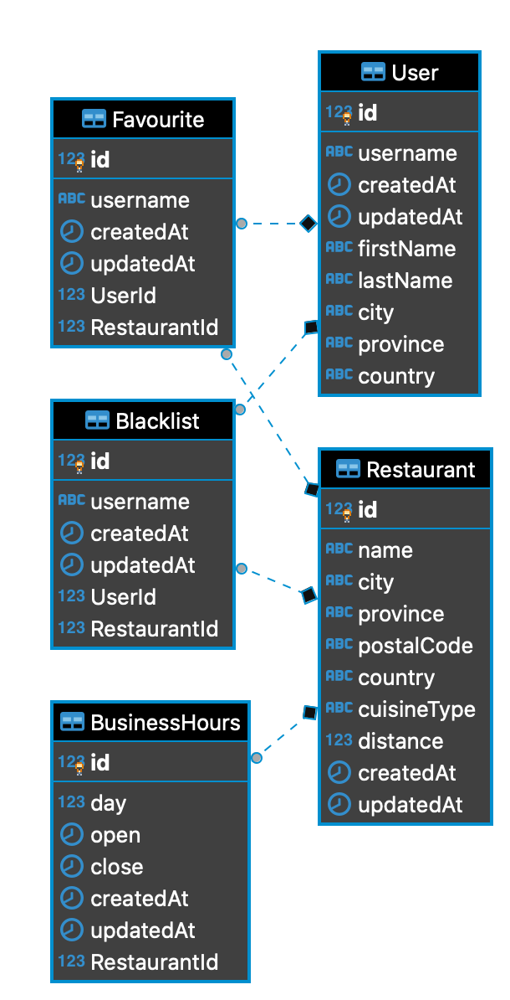

# Resto-Finder

A web service to find restaurant recommendations.

# Overview

Built with Node.Js and PostgreSQL. This service contains two sets of endpoints:

1. For creating and getting users.
2. For creating restaurants, getting recommendations based on a set of filters, updating, faving/unfaving and blacklisting/unblacklisting restaurants.

# Authentication

This web server is for demonstration purposes only. There exists no authentication layer.

# Getting Started

1. Create the env file and add the environment variables for postgres that are compatible for your machine.
   - The db should be called `resto-finder` (as pre-filled below).
   - It is recommended to set `PORT` to 5050 so no changes are needed to the postman collection.
2. Restore the db in `/dump` to Postgres. It is recommended to restore using pgAdmin otherwise please follow instructions [here](https://stackoverflow.com/questions/2732474/restore-a-postgres-backup-file-using-the-command-line)
3. Run `npm install` to install all dependencies.
4. Run `npm run start:dev` to run the web server.
5. Get the Postman collection [here](https://www.getpostman.com/collections/ab1430cf0d84b863e2a5)

# ENV

Create a `.env` file at the project's root directory and add the following environment variables:

```
PORT=
PG_HOST=
PG_USERNAME=
PG_PASSWORD=
PG_DATABASE=resto-finder
PG_PORT=
```

An example file `.env.example` is provided.

# API Docs

The API docs can be found [here](https://documenter.getpostman.com/view/5644120/SzzdD1Mr?version=latest)

# Entity Relationship Diagram


